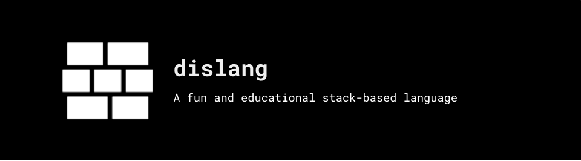

# dis


Dis is [stack-based language](https://en.wikipedia.org/wiki/Stack-oriented_programming) written in Typescript. The language can be compiled down to low-level assembly or be executed by a emulator. It is meant as a educational project to explore the challenges of designing a new language and implementing a compiler from scratch. Feel free to contribute and help out.

## Roadmap

- [X] Basic structure to evaluate arithmetic operations
- [ ] Support if-else statements and looping constructs
- [ ] Support variable declarations
- [ ] Support arrays
- [ ] Add type checking
- [ ] Support functions

## Examples

```txt
3 4 +
$ ; End of program
```

Output: ```7```

## Quick start

Run `npm install -g .` to install the compiler.

### To run in emulator mode

```sh
$ dis run ./examples/first.dis
18
```

### To compile to assembly

```sh
$ dis build ./examples/first.dis output
$ ./output
18
```

## Dependencies

To run this project, you will need to install the following dependencies:

- **NodeJS** - Language the compiler and emulator are written in. (Preferably use `lts/fermium` or higher)
- **nasm** - The assembler that compiles the generated assembly into a binary.
